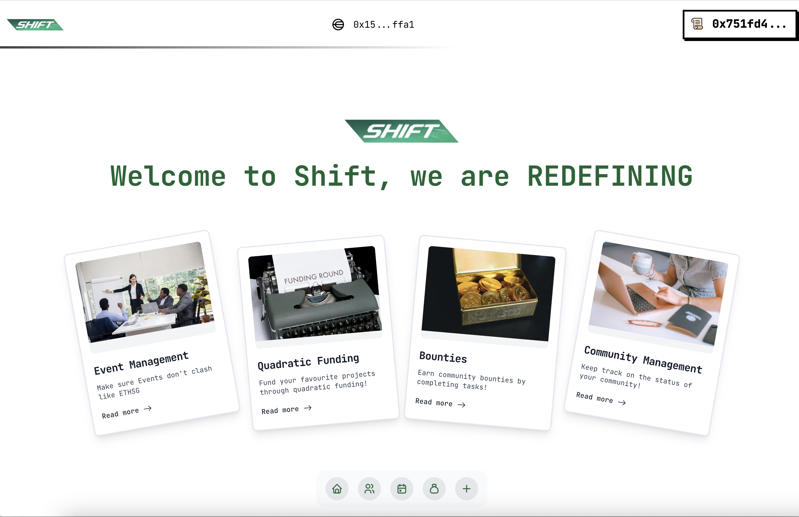

# Scroll Track

Deployed and Verified 5 Smart Contracts on Scroll Network

- Community Registry: [0x37befb162cbacbe012f86c4f4bcda67ae31f584f](https://sepolia.scrollscan.com/address/0x37befb162cbacbe012f86c4f4bcda67ae31f584f#code)
- EventHubManagement: [0xeBdF352B7A61Dc246D415D9A964C81c6522fF640](https://sepolia.scrollscan.com/address/0xeBdF352B7A61Dc246D415D9A964C81c6522fF640#code)
- Bounty: [0xa47c1fe8bdde8a6ae584e3e3c77dc5120f65698d](https://sepolia.scrollscan.com/address/0xa47c1fe8bdde8a6ae584e3e3c77dc5120f65698d#code)
- Prompt (with ORA): [0xa47c1fe8bdde8a6ae584e3e3c77dc5120f65698d](https://sepolia.scrollscan.com/address/0xa47c1fe8bdde8a6ae584e3e3c77dc5120f65698d#code)
- AIGCNft (with ORA): [0xfD32a168D02Ce01A28180d4679f18a8db021279C](https://sepolia.scrollscan.com/address/0xfD32a168D02Ce01A28180d4679f18a8db021279C#code)

Attempt to code zk-quadratic funding
[Code](https://github.com/Laikaiyong/SHIFT/blob/main/contracts/QuadraticFunding/src/quadratic-funding.sol)

# Worldcoin Track

World ID & Incognito Actions Setup

Frontend itegrates World ID Kit

Navbar WorldIDKit [Code](https://github.com/Laikaiyong/SHIFT/blob/main/frontend/src/components/custom/navbar.jsx)

Smart Contract on Scroll records World ID in functions
- EventHubManagement [0xeBdF352B7A61Dc246D415D9A964C81c6522fF640](https://sepolia.scrollscan.com/address/0xeBdF352B7A61Dc246D415D9A964C81c6522fF640#code)

# Ora Track

 Demo video
[Link]()

- Prompt (with ORA): [0xa47c1fe8bdde8a6ae584e3e3c77dc5120f65698d](https://sepolia.scrollscan.com/address/0xa47c1fe8bdde8a6ae584e3e3c77dc5120f65698d#code)
- AIGCNft (with ORA): [0xfD32a168D02Ce01A28180d4679f18a8db021279C](https://sepolia.scrollscan.com/address/0xfD32a168D02Ce01A28180d4679f18a8db021279C#code)